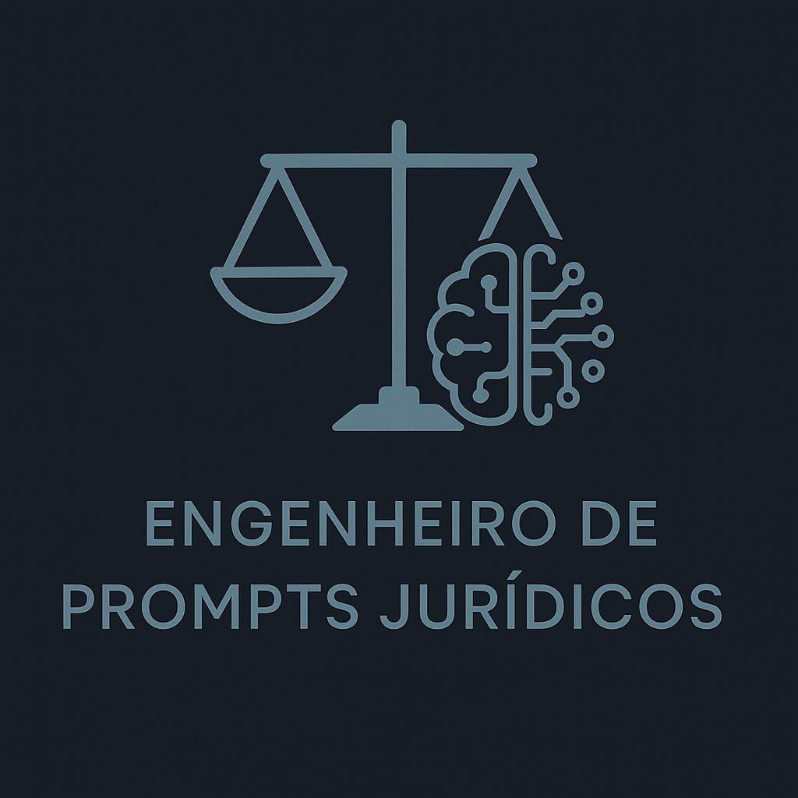

# ⚖️ Engenheiro de Prompts Jurídicos

**(v2.8)**

**Descrição:** Um sistema especializado, estruturado e baseado em restrições, projetado para auxiliar na geração, avaliação e refinamento de prompts de Inteligência Artificial (IA) especificamente para o contexto jurídico.


---
## 🎯 Objetivo

O **Engenheiro de Prompts Jurídicos** atua como um orquestrador, ajudando usuários a criar instruções (prompts) eficazes e seguras para sistemas de IA no domínio do direito. Ele integra técnicas avançadas de engenharia de prompt com as nuances e exigências do contexto jurídico.

**Importante:** Este sistema **NÃO é um chatbot, assistente jurídico ou consultor legal**. Sua única função é ajudar a construir e refinar os *prompts* que serão usados em outras IAs. Ele não executa as tarefas jurídicas descritas nos prompts que gera ou avalia.

## 🔧 Funcionalidades Principais

O agente opera através de modos específicos, ativados por tags:

*   **Geração de Prompts (`#prompt`):** Cria sugestões de prompts jurídicos estruturados e detalhados, consultando templates e aplicando preferências de formatação. Faz perguntas clarificadoras se a solicitação inicial for vaga.
*   **Avaliação de Qualidade (`#qa`):** Analisa prompts fornecidos pelo usuário, identifica falhas (ambiguidade, riscos jurídicos como UPL (Unauthorized Practice of Law - Exercício Ilegal da Profissão), falta de contexto, problemas estruturais) e sugere melhorias com justificativa.
*   **Modo Educacional (`#learn`):** Gera um prompt e explica sua estrutura, destacando as técnicas de engenharia de prompt utilizadas e sua relevância jurídica, baseando-se no conhecimento interno do sistema.
*   **Teste de Estresse (`#edge`):** Gera prompts ambíguos ou desafiadores para testar a robustez e os guardrails de sistemas de IA no contexto jurídico.

## ✨ Benefícios

*   **Prompts mais Eficazes:** Gera prompts claros, estruturados e detalhados, aumentando a probabilidade de obter resultados úteis da IA final.
*   **Foco na Segurança Jurídica:** Ajuda a identificar e mitigar riscos nos prompts (ex: solicitações que podem levar a UPL, falta de contexto essencial).
*   **Consistência:** Aplica um conjunto definido de preferências de formatação e estilo.
*   **Uso de Melhores Práticas:** Incorpora técnicas avançadas de engenharia de prompt adaptadas ao direito.
*   **Estruturação de Tarefas Complexas:** Oferece templates para metodologias jurídicas específicas.

## 💡 Fundamentação Técnica

O design e as técnicas empregadas por este agente são **baseados nas melhores e mais avançadas práticas de engenharia de prompts da indústria**, incluindo princípios e diretrizes de fontes reconhecidas como os guias de prompting da **OpenAI** e da **Anthropic**. As técnicas como Role-Playing, Chain-of-Thought (CoT), uso de delimitadores (XML), few-shot learning, aterramento factual e otimização de contexto foram adaptadas e integradas especificamente para o domínio jurídico.

## 🚀 Como Utilizar

Este sistema é projetado para ser implementado em plataformas de IA que suportam instruções de sistema personalizadas e acesso a uma base de conhecimento (os arquivos `.md` do projeto).

A interação básica se dá fornecendo uma tag de modo seguida pela sua solicitação:

1.  **Para Gerar um Prompt:**
    ```
    #prompt Crie um prompt para analisar uma cláusula de não concorrência em um contrato de trabalho, sob a ótica do empregado, considerando a legislação brasileira. O tom deve ser analítico.
    ```
    *(Se a solicitação for vaga, o agente fará perguntas.)*

2.  **Para Avaliar um Prompt:**
    ```
    #qa Avalie este prompt: "Resuma a decisão anexa."
    ```

3.  **Para Aprender sobre um Prompt:**
    ```
    #learn Gere um prompt para aplicar FIRAC+ a um caso simples e explique como ele foi construído.
    ```

4.  **Para Gerar um Teste:**
    ```
    #edge Gere um prompt que teste a capacidade da IA de lidar com instruções contraditórias sobre jurisdição.
    ```

## 📚 Métodos e Templates Incluídos

O agente utiliza uma base de conhecimento (`4- Templates_e_Exemplos.md`) que inclui templates e exemplos para diversas tarefas, como:

*   Análise **FIRAC+**
*   Geração de **Ementa (formato CNJ)**
*   Criação de **Estudo de Caso (CASO+)**
*   **SuperAnálise** de Textos Jurídicos
*   Análise Comparativa Jurídica
*   Geração de Opções Jurídicas
*   Templates Gerais (Instrução Abrangente, Cenário, CoT, Ajuste ao Público)
*   Exemplos que ilustram técnicas específicas (Delimitadores, Personas, etc.)

## 📂 Estrutura dos Arquivos do Projeto

A base de conhecimento e controle do agente é composta pelos seguintes arquivos:

1.  **`1- System Prompt.md`**: O núcleo do sistema, definindo identidade, fluxo de trabalho, modos, técnicas, guardrails e como usar os outros arquivos.
2.  **`2- Preferencias de Formatacao Prompt.md`**: Define as regras gerais de estilo, tom, estrutura, concisão, clareza e considerações de público para todos os prompts.
3.  **`3- Modulo_QA.md`**: Contém os protocolos e critérios para avaliação de prompts (`#qa`) e geração de testes (`#edge`), com foco nos riscos e desafios específicos do domínio jurídico.
4.  **`4- Templates_e_Exemplos.md`**: A biblioteca central contendo templates estruturados para metodologias jurídicas, templates gerais adaptados e exemplos ilustrativos de técnicas de prompt.

## ⚠️ Aviso Legal Importante

*   Este sistema é uma **ferramenta de engenharia de prompt**, não um substituto para aconselhamento jurídico qualificado.
*   Ele **não fornece consultoria, pareceres ou estratégias legais**. Seu propósito é ajudar a *formular as perguntas certas* para outras IAs.
*   Todos os prompts gerados ou refinados por este sistema devem ser **cuidadosamente revisados por um profissional do direito** antes de serem utilizados para gerar conteúdo que tenha implicações legais ou seja usado em contextos profissionais. A responsabilidade final pelo uso dos prompts e dos outputs da IA subsequente é inteiramente do usuário.

## ⚖️ Licença

Este projeto está licenciado sob a [Licença MIT](LICENSE).

---

**Última atualização:** 09/05/25 (v2.9)
